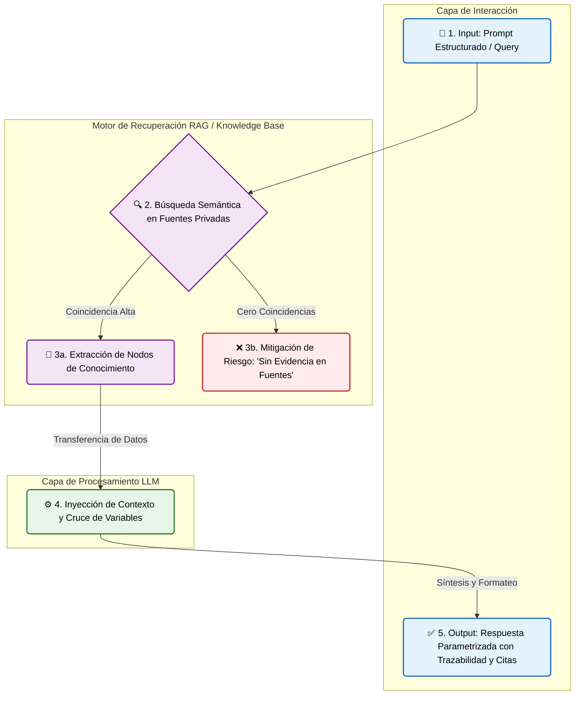

# NotebookLm

# 🧠 Cuadro de Mando: Tu Agente de Conocimiento Diario con NotebookLM

  
  
  

---

> [!IMPORTANT]
> **¡Bienvenido a tu centro de operaciones!** > Este repositorio es un sistema metodológico público y gratuito diseñado para enseñarte a transformar **Google NotebookLM** en tu asistente personal, ya sea para organizar tu vida cotidiana o para la gestión profesional de alto nivel, aquí aprenderás a ir de cero a experto! 

---

## 📌 1. ¿Qué es NotebookLM y por qué cambiará tu forma de trabajar?

La mayoría de las personas usan IAs tradicionales (como ChatGPT) para "buscar en internet", **NotebookLM es diferente** ya que es un **agente de síntesis y razonamiento sobre tu propia información**

### 🧩 El Secreto Técnico... ¿Qué es el RAG?
NotebookLM funciona con una tecnología llamada **RAG (Retrieval-Augmented Generation)**
* **El riesgo del modelo estándar:** Un modelo de lenguaje tradicional (LLM) actúa como un consultor generalista que intenta responder "de memoria" basándose en su entrenamiento con datos de internet, al operar de forma probabilística, si desconoce un dato exacto, tiende a inventarlo para sonar convincente (lo que técnicamente llamamos "alucinación"), en la toma de decisiones, esto es un riesgo inaceptable.
* **El control absoluto del RAG (Retrieval-Augmented Generation):** Esta arquitectura transforma a la IA en un auditor estricto con una base de conocimiento cerrada, al usar RAG, le cortas el acceso a internet y la "anclas" exclusivamente a los activos de información que tú le proporcionas, el agente tiene prohibido adivinar u opinar, está obligado a extraer, cruzar y sintetizar *solo* tus datos, garantizando un 100% de trazabilidad en cada respuesta.

Aquí tienes cómo funciona este flujo de manera visual:

> [!TIP]
> **Audio Overviews (El Podcast de tu vida):** Además de texto, NotebookLM puede convertir tus apuntes o documentos financieros en un "podcast" donde dos presentadores de IA discuten tu información de forma amena. Pruébalo y me cuentas!! 

---

## ⚙️ 2. Arquitectura del Repositorio

Para sacarle el máximo provecho, He diseñado un flujo de trabajo estructurado en tres pilares:

| Carpeta | Contenido Principal | Objetivo Estratégico | Nivel |
| :--- | :--- | :--- | :---: |
| `📁 /plantillas` | Documentos maestros en blanco | Estandarizar la forma en que le entregas datos a la IA (inputs) | 🟢 Básico |
| `📁 /prompts` | Fórmulas y estructuras de texto | Enseñar a la IA a pensar de forma crítica y cruzar variables | 🟡 Intermedio |
| `📁 /ejemplos` | Casos de estudio documentados | Mostrar el "Antes y Después" en escenarios reales para inspirarte | 🔴 Avanzado |

---

## 🚀 3. El Sistema Paso a Paso

Haz clic en cada fase para expandir las instrucciones detalladas:

<b>Fase 1: Configuración de tu "Cerebro Digital"</b>

 

1. Ve a [NotebookLM de Google](https://notebooklm.google.com/) e inicia sesión.
2. Haz clic en **"Nuevo cuaderno"**. 
3. *Regla de Oro:* Crea un cuaderno por contexto, por ejemplo, ten un cuaderno llamado "Finanzas Personales", otro "Universidad/Estudios" y otro "Proyectos de Trabajo" **OJO! No mezcles los temas**

<b>Fase 2: Estandarización de Entradas (Ingesta)</b>

 

La IA trabaja mejor si le das la información ordenada 
1. Entra a la carpeta `📁 /plantillas` de este repositorio
2. Descarga la **"Matriz de Descarga Estratégica"**
3. Llena ese documento durante tu semana con tus ideas, gastos o notas
4. Sube ese documento a tu cuaderno de NotebookLM

<b>Fase 3: Orquestación (Ingeniería de Prompts)</b>

 

Aquí es donde la mayoría falla porque le hacen preguntas muy simples o poco estructuradas a la IA
1. Ve a la carpeta `📁 /prompts` de este repositorio
2. Copia la estructura del **"Framework de Anclaje Analítico (FAA)"**
3. Pégala en el chat de NotebookLM y usa nuestra ingeniería de PROMPT más efectiva y validada!

---

## ⚠️ 4. Límites del Sistema

> [!WARNING]
> Para manejar las expectativas, recuerda que NotebookLM es un **agente de conocimiento**, no un agente de acción externa.

* ❌ No enviará correos por ti
* ❌ No agendará reuniones en tu Google Calendar automáticamente
* ❌ No navegará por internet buscando noticias en tiempo real

---

## 🤝 Sobre el Autor y Cómo Puedo Ayudarte

¡Hola! Soy **Kevin Daza**. 

Como Cofundador de la agencia **T-Gency** y docente del *Curso de Agentes Virtuales para la Alta Gerencia* en la **Universidad del Rosario** y la **Universidad de Guayaquil**, mi principal interés con este repositorio es **democratizar el uso de la Inteligencia Artificial**, quiero que cualquier persona, sin importar su nivel técnico, pueda aprovechar estas herramientas para mejorar su calidad de vida y optimizar su tiempo.

Este material siempre será público y de libre acceso, sin embargo, si tú o tu empresa buscan llevar esto al siguiente nivel para ganar competitividad en el mercado, ofrezco servicios especializados:

* 🧠 **Asesorías personalizadas en Inteligencia Artificial**
* ⚙️ **Desarrollo e implementación de proyectos a la medida**
* 🚀 **Automatizaciones de marketing y procesos operativos complejos**
* 📚 **Cursos para crear agentes virtuales con orquestación más completa**

Si necesitas apoyo con la orquestación de agentes corporativos, flujos de trabajo automatizados o simplemente tienes una visión que quieres materializar, **no dudes en escribirme; con gusto te apoyaré.**

🔗 **Conecta conmigo:** 

---

  <i>Construido para la comunidad, si este repositorio te fue útil, no olvides darle una ⭐ en la parte superior derecha!</i>

