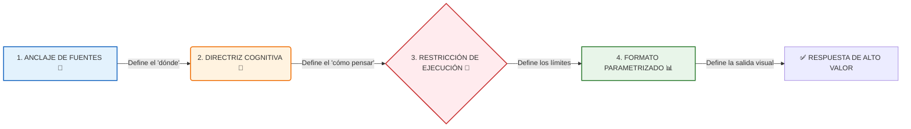

# 🧬 Ingeniería de Prompts: El Framework de Anclaje Analítico (FAA)

> [!NOTE]
> **El error común:** La mayoría de las personas le pide a la IA cosas como: *"Hazme un resumen de esto"*, eso es subutilizar la herramienta y no es recomendable!
> **La solución profesional:** Usar una estructura que fuerce a NotebookLM a **cruzar variables, pensar críticamente y parametrizar la salida**

Este framework se compone de 4 bloques lógicos que debes ensamblar en tu instrucción:

---

## 📋 Prompt Maestro (Para copiar y adaptar)

Copia el siguiente bloque y reemplaza los textos entre corchetes `[ ]` en el chat de NotebookLM según tu necesidad

> **[1. ANCLAJE DE FUENTES]**
> Analiza exhaustivamente las siguientes fuentes de mi cuaderno: [Nombra el documento A] y crúzalo con la información de [Nombra el documento B]
> 
> **[2. DIRECTRIZ COGNITIVA]**
> Actúa como un [Rol Experto: ej. Auditor Financiero, Coach de Productividad, Analista de Estrategia], Tu objetivo es [Verbo de alto nivel: ej. Diagnosticar fricciones, identificar patrones ocultos, auditar riesgos] en la información proporcionada, Adopta una mentalidad [Tipo de pensamiento: ej. Crítica, "abogado del diablo", creativa]
> 
> **[3. RESTRICCIÓN DE EJECUCIÓN]**
> - Basa tu análisis ÚNICAMENTE en los hechos verificables en los documentos, no inventes información
> - Si encuentras un dato contradictorio entre dos fuentes, resáltalo explícitamente
> - Ignora [Tipo de información irrelevante: ej. los saludos en los correos]
> 
> **[4. FORMATO PARAMETRIZADO]**
> Preséntame la respuesta estrictamente en este formato:
> 1. Un diagnóstico ejecutivo de máximo 3 líneas
> 2. Una tabla Markdown con las siguientes columnas: [Columna 1] | [Columna 2] | [Columna 3]
> 3. Una lista de viñetas con 3 acciones inmediatas recomendadas basadas en el análisis

---

## 🚀 Ejemplo Práctico: Auditoría de Proyectos (Nivel Directivo)

*Supuesto: Has subido las minutas de las últimas reuniones y el PDF del presupuesto oficial*

> **[ANCLAJE]** Cruza la información de los documentos "Minutas_Reuniones_Q1" con el archivo "Presupuesto_Oficial.pdf"
>
> **[DIRECTRIZ]** Actúa como un Auditor de Riesgos Corporativos implacable, aplica un pensamiento de "abogado del diablo", tu objetivo es buscar discrepancias peligrosas entre lo que el equipo directivo prometió hacer (en las minutas) y la realidad financiera que tenemos asignada (en el presupuesto)
>
> **[RESTRICCIÓN]**
> - Solo expón hechos donde puedas citar la fuente
> - Si un costo mencionado como "aprobado" en una reunión NO aparece en el PDF del presupuesto, catalógalo como "ALERTA ROJA o Punto Ciego Financiero"
> - Limita tu análisis a las 5 amenazas más críticas
>
> **[FORMATO]**
> 1. Diagnóstico de salud del proyecto
> 2. Tabla Markdown: [Riesgo Detectado] | [Origen de la Promesa (Minuta)] | [Estatus en Presupuesto Real] | [Nivel de Impacto]
> 3. Tres preguntas incómodas que debo hacerle al equipo financiero mañana

---

## 🏡 Ejemplo Práctico: Gestión Personal (Nivel Cotidiano)

*Supuesto: Has subido tu "Matriz de Descarga Estratégica" de la semana*

> **[ANCLAJE]** Analiza mi "Matriz de Descarga Estratégica" de esta semana
>
> **[DIRECTRIZ]** Actúa como mi Jefe de Operaciones Personales (COO), tu objetivo es transformar mi caos mental en un plan de ataque para el lunes, prioriza despiadadamente
>
> **[RESTRICCIÓN]**
> - Ignora por completo la sección de "Radar de Ideas" para este plan de acción inmediata
> - Si una tarea en "Fricciones" se ha repetido más de dos semanas seguidas, márcala con 🚨
>
> **[FORMATO]**
> Entrégame una lista de tareas dividida en tres bloques:
> - 🔥 Fuego (Urgente/Importante para el lunes en la mañana)
> - 📅 Planificación (Importante pero no urgente, para agendar en la semana)
> - 🛒 Logística (Compras y recados rápidos)
